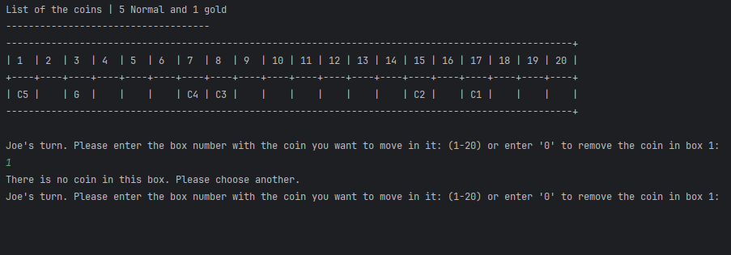

# Development Log

The development log captures key moments in your application development:

- **Design ideas / notes** for features, UI, etc.
- **Key features** completed and working
- **Interesting bugs** and how you overcame them
- **Significant changes** to your design
- Etc.

---

## Date: 29/04/2025

The game was not picking up that there were coins in box 1. I changed this by making my Coinindex to "< 0" instead of "< 1."

---

## Date: 29/04/2025

Example description and notes. Example description and notes. Example description and notes. Example description and notes. Example description and notes. Example description and notes.

---

## Date: xx/xx/2025

Example description and notes. Example description and notes. Example description and notes. Example description and notes. Example description and notes. Example description and notes.

---

## Date: xx/xx/2025

Example description and notes. Example description and notes. Example description and notes. Example description and notes. Example description and notes. Example description and notes.

---

## Date: xx/xx/20xx

Example description and notes. Example description and notes. Example description and notes. Example description and notes. Example description and notes. Example description and notes.

---

