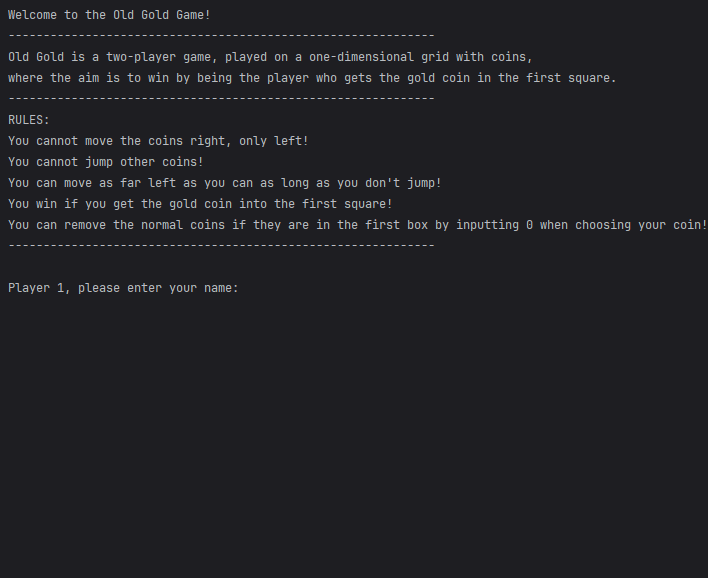
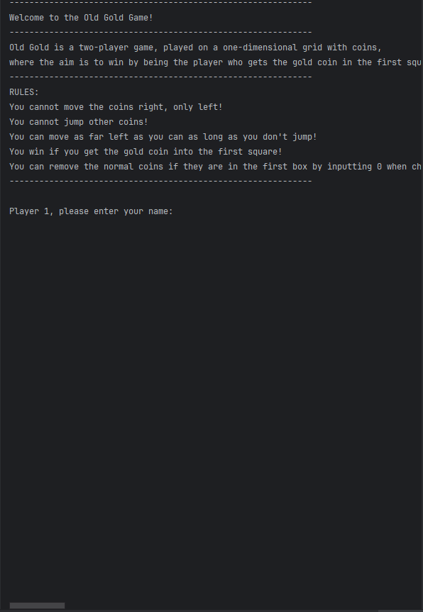
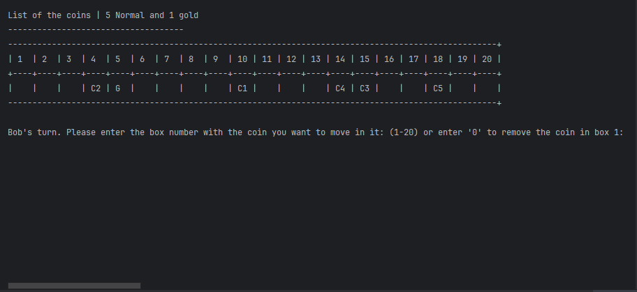
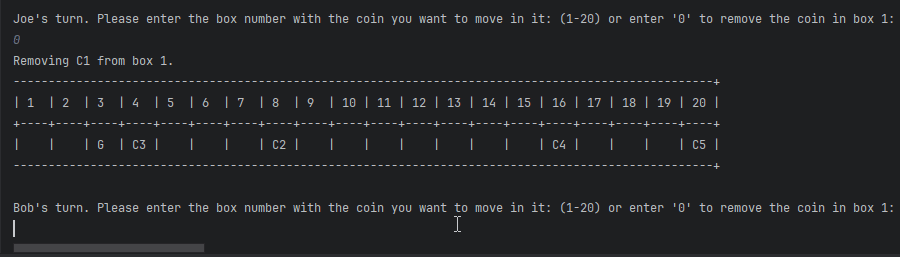

# Results of Testing

The test results show the actual outcome of the testing, following the [Test Plan](test-plan.md)

---

## The users can input their names.

The users can input their names as player 1 and 2 and the game will recognize this.

### Test Data Used

This was selected as it is needed to identify the players and give them their own inputs for when it is their turn.

### Test Result

The code recognized the players names when they were input into the game.

---

## Coin randomizing

When the players input their names, the board will print and randomise all coins.

### Test Data Used

This was selected to make the game different every time someone would play

### Test Result

The result of this was good. The coins would randomize every time the game was reset leading to this being a success.

---

## Player moves and Turns

When the board is printed the game starts, the game then asks player 1 to have a turn. After player 1 has had a turn it will tell player 2 to go.

### Test Data Used

This was selected to let the players cycle through turns until the end of the game.

### Test Result

This works as it should. The players have turns after each other until the game ends.

---

## Player wins the game

When a player gets the Gold coin into the first square on the board they win the game.

### Test Data Used

This was selected to end the game with a final winner.

### Test Result

This works. A player input the gold coin into the first square and won the game.

---

